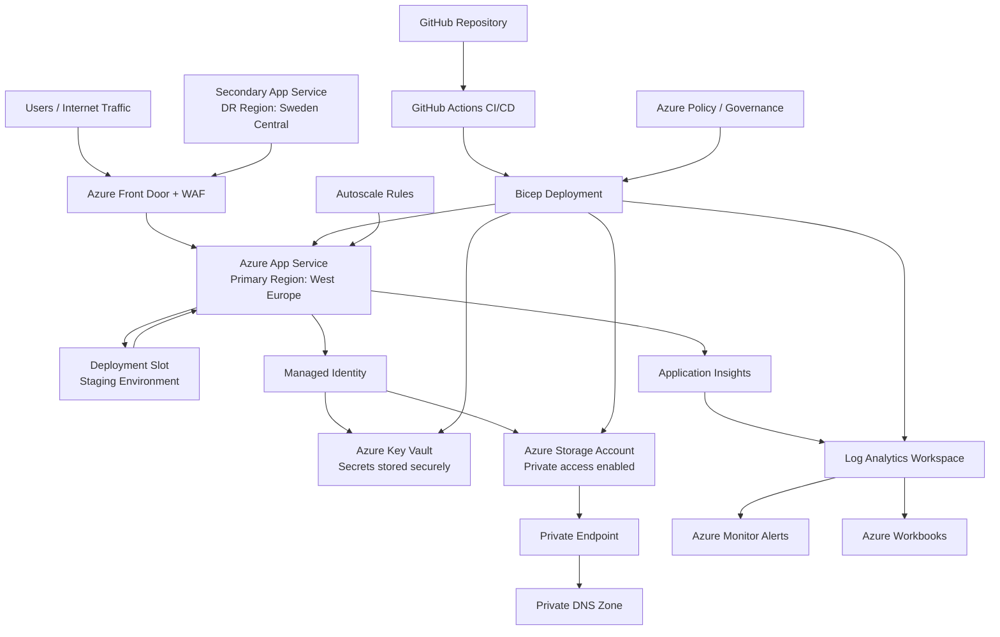

# CloudNest Azure Infrastructure Architecture

CloudNest is a production-style Azure infrastructure project built with Bicep. The goal of this project is to demonstrate how cloud infrastructure can be designed, deployed, secured, monitored, and governed using Infrastructure as Code.

## Architecture Diagram

## Architecture Overview

CloudNest uses Azure Front Door as the public entry point, protected by a Web Application Firewall policy. Traffic is routed to an Azure App Service hosted in the primary region, West Europe.

The application uses Managed Identity to access Azure Key Vault and other Azure services without storing secrets in code or configuration files.

Storage services are protected using Private Endpoints and Private DNS Zones. Monitoring is handled through Application Insights, Log Analytics, Azure Monitor alerts, and Azure Workbooks.

## Main Components

- Azure Front Door with WAF for secure public access
- Azure App Service for application hosting
- Deployment slots for safer releases
- Managed Identity for secretless authentication
- Azure Key Vault for secret management
- Storage Account with private access
- Private Endpoints and Private DNS Zones for zero-trust networking
- Application Insights and Log Analytics for observability
- Azure Monitor alerts and Workbooks for operations
- GitHub Actions with Bicep for CI/CD deployment
- Azure Policy for governance
- Autoscale rules for performance and cost control
- Secondary App Service for disaster recovery planning

## Request Flow

1. Users access the application through Azure Front Door.
2. WAF policies inspect and protect incoming traffic.
3. Front Door routes valid requests to the primary App Service.
4. The App Service uses Managed Identity to access Key Vault and Azure resources.
5. Storage access is secured through Private Endpoints and Private DNS.
6. Logs and telemetry are collected in Application Insights and Log Analytics.
7. Alerts and Workbooks provide operational visibility.
8. Deployment slots are used to support staging and safer production release workflows. Application changes can be validated in the staging slot before being swapped into production.

## Architecture Decisions

### Why Bicep?

Bicep was used to define Azure infrastructure as code. This makes the environment repeatable, version-controlled, and easier to maintain.

### Why Azure App Service?

App Service was selected because it is a managed platform for hosting web applications without managing virtual machines.

### Why Azure Front Door?

Azure Front Door provides a global entry point, HTTPS access, WAF integration, and future-ready failover routing.

### Why Managed Identity and Key Vault?

Managed Identity avoids storing credentials in code. Key Vault stores secrets securely and allows the application to access them through Azure-native identity.

### Why Private Endpoints?

Private Endpoints reduce public exposure by allowing Azure services to be accessed privately through the virtual network.

## Disaster Recovery Design

CloudNest includes a secondary App Service in Sweden Central. Azure Front Door can route traffic between the primary and secondary application origins, supporting a future regional failover design.

## Summary

This architecture demonstrates a realistic Azure cloud platform using Infrastructure as Code, secure networking, CI/CD automation, monitoring, governance, and disaster recovery concepts.