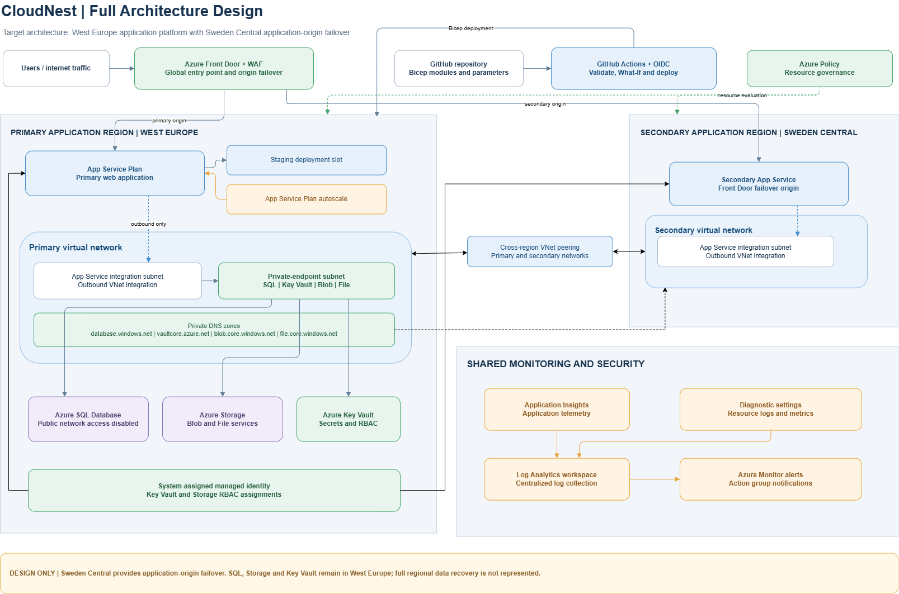
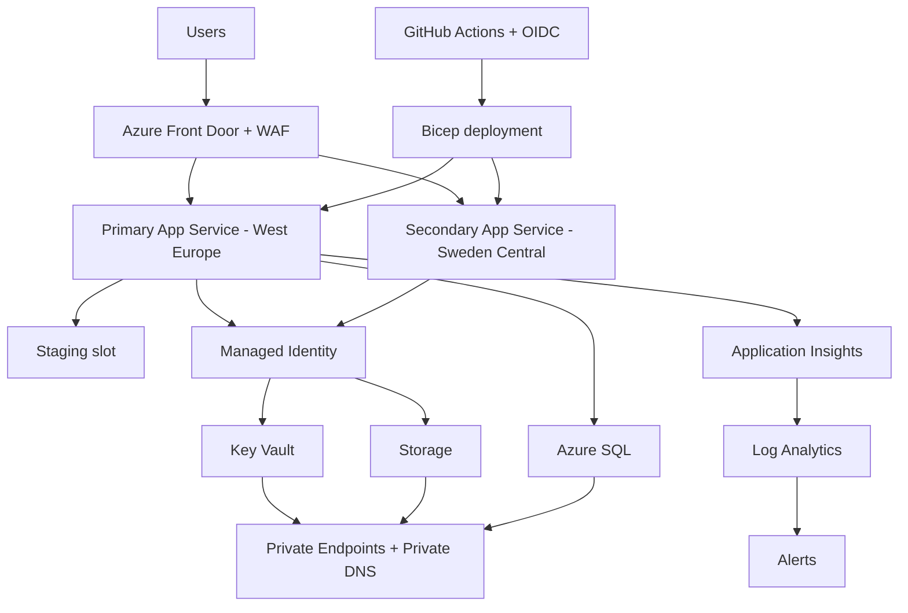

# Architecture

CloudNest has a bigger production-style design and a smaller portfolio profile which I used for the real Azure deployment.

The full design stays in Bicep because I wanted to show how I would structure the platform with application-origin failover, Front Door, WAF, deployment slot and autoscale. The smaller profile was made because my Azure subscription had real quota and cost limits.

## Full design

The full design uses West Europe as the primary application region and Sweden Central as the secondary application region.

Traffic enters through Azure Front Door with WAF. Front Door can route to the primary and secondary App Service origins. The primary App Service also has a staging slot and autoscale in the full design.

The application layer connects to Azure SQL, Storage and Key Vault through the VNet and private endpoints. Cross-region VNet peering and linked private DNS zones allow the secondary application region to reach those services.

SQL, Storage and Key Vault remain in West Europe. The Sweden Central application origin provides application failover, not full regional data recovery.

The Web App uses Managed Identity for Azure access. Monitoring is built with Application Insights, Log Analytics, diagnostic settings and Azure Monitor alerts. Azure Policy is used for location, tagging and storage security rules.

```mermaid
flowchart TD
    A[Users] --> B[Azure Front Door + WAF]
    B --> C[Primary App Service - West Europe]
    B --> D[Secondary App Service - Sweden Central]
    C --> E[Staging slot]
    C --> F[Managed Identity]
    D --> F
    F --> G[Key Vault]
    F --> H[Storage]
    C --> I[Azure SQL]
    G --> J[Private Endpoints + Private DNS]
    H --> J
    I --> J
    C --> K[Application Insights]
    K --> L[Log Analytics]
    L --> M[Alerts]
    N[GitHub Actions + OIDC] --> O[Bicep deployment]
    O --> C
    O --> D
```

## Portfolio deployment

For the live portfolio deployment I reduced the design instead of trying to deploy everything only for showing it.

The portfolio profile used Sweden Central, one B1 App Service and Azure SQL Free. DR, Front Door, deployment slot and autoscale were disabled for this profile.

The parts I wanted to prove in Azure were still there: VNet integration, private endpoints, private DNS, Key Vault, Storage, Managed Identity, RBAC, monitoring, diagnostics, alerts and Azure Policy.

This profile was successfully deployed and checked from the Azure control plane. The evidence is in [live deployment verification](docs/evidence/portfolio-deployment/live-deployment-verification.md).

Both architecture diagrams are available in the [editable draw.io file](docs/architecture/cloudnest-architecture.drawio).

## Why I kept both

I kept both because they answer two different things.

The full design shows the architecture I wanted to build. The portfolio profile shows what I could actually deploy safely with the subscription I had.

For me this was better than changing the full design only to fit one temporary subscription limitation.

## Main choices

I used Bicep because I wanted the infrastructure to stay repeatable and version controlled.

I used App Service because I wanted a managed application platform instead of managing virtual machines.

Front Door and WAF are part of the full design for public entry, routing and application-origin failover. They were not needed for the small live portfolio deployment.

Private endpoints were important because I wanted SQL, Storage and Key Vault away from public network access in the deployed profile.

Managed Identity and RBAC were used so the Web App did not need hard coded Azure credentials.

## Current state

The live portfolio workload was removed after verification so it does not keep generating cost. The deployment evidence was captured before cleanup and the Bicep stays ready for another controlled deployment later.
