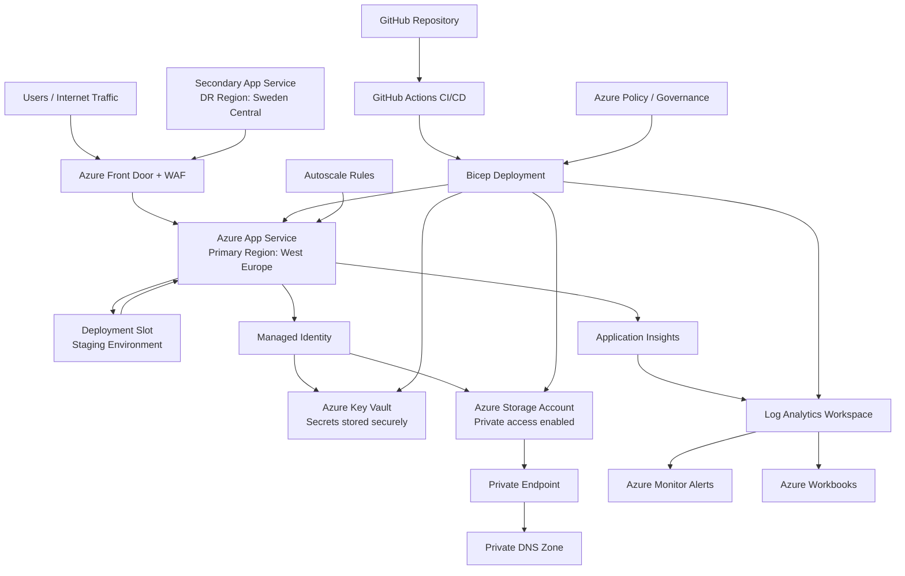

# CloudNest - Azure Infrastructure Platform with Bicep

CloudNest is a production-style Azure infrastructure platform built using Infrastructure as Code (IaC) with Bicep.

The project demonstrates how modern Azure environments can be designed, automated, secured, monitored, and governed using Azure-native services and DevOps practices.

CloudNest was built as a hands-on cloud engineering portfolio project focused on real operational concepts rather than simple Azure resource deployment.

---

# Project Goal

The goal of CloudNest is to simulate a realistic Azure cloud environment using:

- Infrastructure as Code
- secure networking
- identity-based security
- monitoring and observability
- CI/CD automation
- governance and policy enforcement
- autoscaling and operational practices
- disaster recovery concepts

The project focuses on operational maturity, automation, and Azure-native architecture patterns commonly used in real cloud environments.

---

# Architecture Overview

CloudNest includes:

- Azure Front Door with WAF
- Azure App Service
- Deployment Slots for staging and production workflows
- Managed Identity authentication
- Azure Key Vault
- Private Endpoints
- Private DNS Zones
- Azure Monitor and Log Analytics
- Azure Workbooks dashboards
- Azure Monitor Alerts
- GitHub Actions CI/CD
- Azure Policy governance
- Autoscaling
- Backup and disaster recovery concepts

---

# Architecture Diagram

<p align="center">



</p>

Additional architecture details are available in:

- [ARCHITECTURE.md](./ARCHITECTURE.md)
- [SECURITY.md](./SECURITY.md)
- [OPERATIONS.md](./OPERATIONS.md)
- [GOVERNANCE.md](./GOVERNANCE.md)

---

# Core Technologies

| Area | Services |
|---|---|
| Infrastructure as Code | Bicep |
| Compute | Azure App Service |
| Networking | VNet, Private Endpoints, Private DNS |
| Security | Azure Key Vault, Managed Identity, WAF |
| Monitoring | Azure Monitor, Log Analytics, Application Insights |
| DevOps | GitHub Actions |
| Governance | Azure Policy |
| Scalability | Azure Autoscale |
| Disaster Recovery | Front Door failover design |

---

# Key Features

## Infrastructure as Code

- Modular Bicep architecture
- Reusable deployment modules
- Automated Azure deployments
- Centralized infrastructure management

## Security

- Managed Identity authentication
- Azure Key Vault integration
- Azure Front Door WAF protection
- Private Endpoints
- Private DNS Zones
- Zero-trust networking approach

## Monitoring and Operations

- Azure Monitor alerts
- Application Insights telemetry
- Log Analytics Workspace
- Azure Workbooks dashboards
- Operational monitoring and visibility

## Deployment Slots

CloudNest uses Azure App Service deployment slots to support staging and production workflows.

The staging slot allows infrastructure and application changes to be validated before swapping into production.

This helps reduce deployment risk and downtime.

## Governance and FinOps

- Azure Policy enforcement
- Required resource tagging
- Policy remediation tasks
- Cost optimization practices
- Autoscaling configuration
- Storage lifecycle management

## CI/CD Pipelines

CloudNest implements separate infrastructure and application deployment pipelines using GitHub Actions.

### Infrastructure CI/CD

Automates Azure infrastructure deployments using:

- Azure Bicep
- GitHub Actions
- OIDC Federation
- What-If validation
- Incremental ARM deployments

Documentation:

```text
docs/infrastructure-cicd.md
```

---

### Application CI/CD

Automates application deployments using:

- GitHub Actions
- Azure App Service
- Deployment Slots
- Managed Identity
- Azure Key Vault

Documentation:

```text
docs/application-cicd.md
```

---

### CI/CD Architecture

```text
Infrastructure Pipeline
    ↓
Deploy Azure Resources

Application Pipeline
    ↓
Deploy App to Staging
    ↓
Slot Swap to Production
```

### Live Application Features

The sample Node.js application demonstrates:

- Environment awareness
- Secure secret retrieval from Key Vault
- Cloud-native deployment workflow
---

# Project Structure

```text
cloudnest-bicep/
├── .github/
│   └── workflows/
│       ├── deploy-infra.yml
│       └── app-deploy.yml
│
├── docs/
│   ├── application-cicd.md
│   ├── finops.md
│   ├── governance-policy.md
│   ├── infrastructure-cicd.md
│   └── workBook.md
│
├── infra/
│   ├── main.bicep
│   ├── main.json
│   ├── main.parameters.json
│   └── modules/
│
├── outputs/
│   ├── phase1-output.txt
│   └── validation-output.txt
│
├── screenshots/
│   ├── alerts.PNG
│   ├── architecture-diagram.PNG
│   ├── autoscale.PNG
│   ├── deployment-slots.PNG
│   ├── frontdoor-waf.PNG
│   ├── keyvault-reference.PNG
│   ├── policy-compliance.PNG
│   └── private-endpoints.PNG
│
├── scripts/
│   └── validate-cloudnest.sh
│
├── src/
│   ├── app.js
│   ├── package.json
│   ├── package-lock.json
│   └── node_modules/
│
├── ARCHITECTURE.md
├── GOVERNANCE.md
├── OPERATIONS.md
├── SECURITY.md
├── README.md
└── .gitignore
```
---

# Quick Deployment

## Clone Repository

```bash
git clone https://github.com/Amin-Azad/cloudnest-bicep.git
cd cloudnest-bicep
```

## Login to Azure

```bash
az login
```

## Create Resource Group

```bash
az group create \
  --name rg-cloudnest-dev \
  --location westeurope
```

## Deploy Infrastructure

```bash
az deployment group create \
  --resource-group rg-cloudnest-dev \
  --template-file infra/main.bicep
```

---

# Infrastructure Validation

CloudNest includes a validation script to verify deployed Azure resources and operational configuration.

Run:

```bash
./scripts/validate-cloudnest.sh
```

Validation output is stored in:

```text
outputs/validation-output.txt
```

The validation process checks:

- App Services
- deployment slots
- Front Door and WAF
- autoscaling
- alerts
- private endpoints
- Key Vault
- Azure Policy
- monitoring resources
- disaster recovery configuration

---

# Platform Screenshots

| Feature | Screenshot |
|---|---|
| Architecture Diagram | `screenshots/architecture-diagram.png` |
| Front Door + WAF | `screenshots/frontdoor-waf.png` |
| Deployment Slots | `screenshots/deployment-slots.png` |
| Private Endpoints | `screenshots/private-endpoints.png` |
| Azure Keyvaults | `screenshots/keyvault-reference.png` |
| Azure Monitor Alerts | `screenshots/alerts.png` |
| Autoscaling | `screenshots/autoscale.png` |
| Azure Policy Compliance | `screenshots/policy-compliance.png` |
| GitHub Actions Pipeline | `screenshots/github-actions.png` |

---

# Operational Design

CloudNest simulates production-style Azure operational practices including:

- monitoring and observability
- deployment automation
- secure networking
- policy enforcement
- autoscaling
- disaster recovery planning
- operational validation
- centralized logging

---

# Learning Outcomes

This project helped strengthen practical experience with:

- Azure Infrastructure as Code
- cloud networking
- Azure security services
- monitoring and observability
- GitHub Actions CI/CD
- governance and policy management
- Azure operational practices
- disaster recovery concepts

---

# Future Improvements

Future enhancements may include:

- Terraform implementation
- AKS migration
- Blue/Green deployment workflows
- Azure Defender integration
- multi-region failover
- advanced governance policies
- Sentinel integration

---

# Author

Amin Azad

Azure | Cloud | Infrastructure | DevOps Portfolio Project