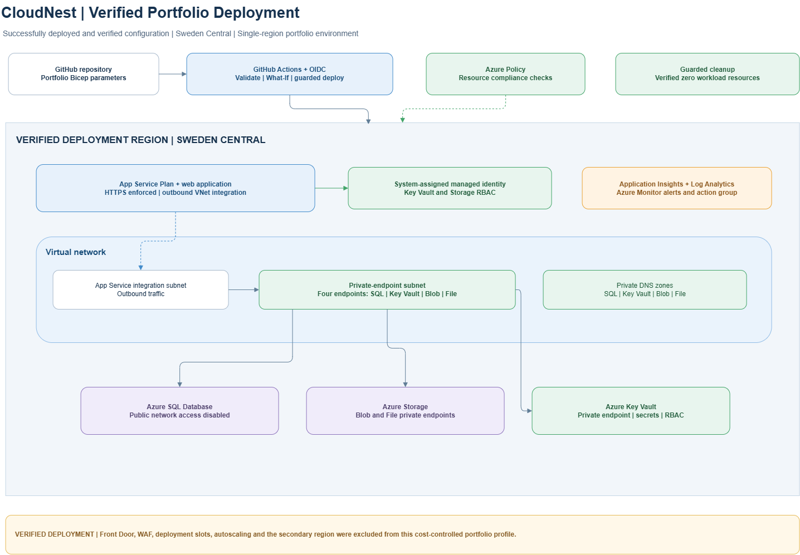
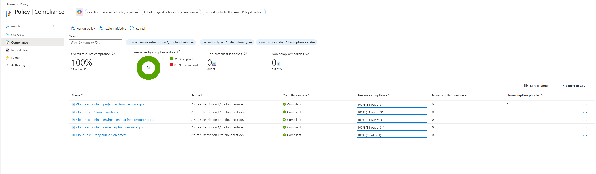
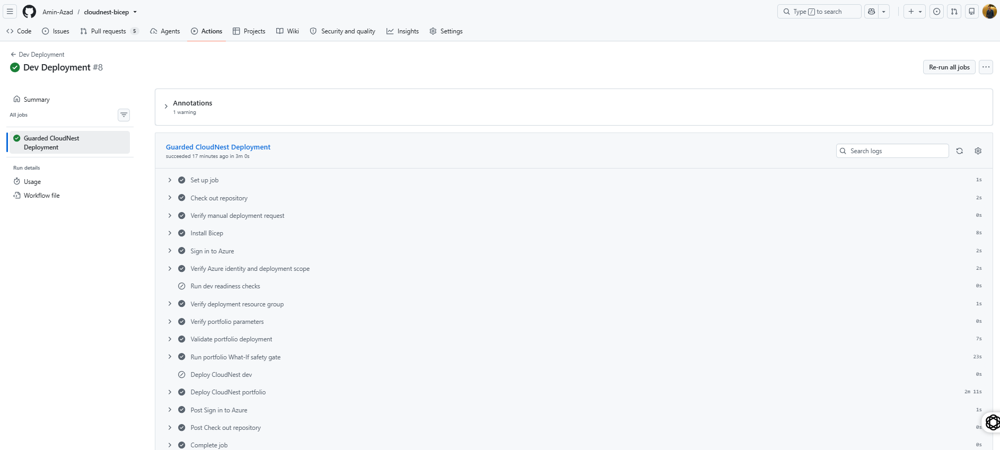

# CloudNest

CloudNest is an Azure infrastructure project I built to practice Bicep, private networking, identity, governance and guarded deployment through GitHub Actions.

I kept two versions of the platform in the same repository: a larger production-style design and a smaller portfolio profile that I could deploy safely with the Azure subscription I had. The smaller profile was deployed successfully in Sweden Central, verified from the live Azure environment and cleaned up afterward.

> **Status:** portfolio profile deployed, verified and cleaned up. The larger design remains implemented in Bicep but is not presented as a fully deployed production environment.



## What I actually deployed

The portfolio profile used one B1 Linux App Service with VNet integration, Azure SQL Free, Storage and Key Vault. SQL, Storage and Key Vault had public network access disabled.

Four private endpoints were created for Azure SQL, Blob Storage, File Storage and Key Vault. Private DNS zones and VNet links were created for the same services.

The App Service used a system-assigned managed identity. I assigned **Key Vault Secrets User** on the Key Vault and **Storage Blob Data Reader** on the Storage account.

Monitoring included Log Analytics, Application Insights, diagnostic settings, an action group, a high CPU alert and an HTTP 5xx alert.

The live environment reached **32 resources before cleanup**. Azure Policy later reported **31 compliant resources out of 31 evaluated** with no non-compliant policies.



The complete deployment record is in [CloudNest Portfolio Deployment Verification](docs/evidence/portfolio-deployment/live-deployment-verification.md).

## Profiles and scope

| Profile | Purpose | Status |
| --- | --- | --- |
| portfolio | Single-region deployment that fits the subscription limits | Deployed, verified and cleaned up |
| dev | Larger development configuration | Bicep and parameter path retained |
| Full design | Primary and secondary App Service regions with Front Door, WAF, slot and autoscale | Implemented in Bicep, not live-tested as a complete platform |

The full design uses West Europe for the primary application region and Sweden Central for a secondary application origin. SQL, Storage and Key Vault remain in the primary region.

That means the secondary region provides **application-origin failover**, not full regional data recovery. I keep that distinction explicit because the data tier was not designed or tested as a complete cross-region DR solution.

The full architecture is documented in [ARCHITECTURE.md](ARCHITECTURE.md) and the editable diagram is in [docs/architecture/cloudnest-architecture.drawio](docs/architecture/cloudnest-architecture.drawio).

## Security

The deployed profile focused on a few controls I wanted to prove in Azure rather than only describe in Bicep.

- SQL, Storage and Key Vault used private access.
- App Service used HTTPS only and minimum TLS 1.2.
- Storage blocked anonymous blob access.
- Key Vault used Azure RBAC.
- App Service used Managed Identity for Azure access.
- GitHub Actions authenticated with Azure through OIDC instead of a stored client secret.
- The deployment identity was kept away from subscription Owner access.

The repository now also runs a dedicated infrastructure regression test in CI so these settings are harder to remove accidentally.

More detail is in [SECURITY.md](SECURITY.md).

## Deployment flow

Infrastructure changes follow a guarded path:

```text
pull request
    ↓
repository validation
    ↓
Azure readiness checks
    ↓
Azure What-If
    ↓
manual confirmation + approved commit
    ↓
guarded deployment
    ↓
live verification
    ↓
guarded cleanup
```

The deployment workflow requires an explicit profile and confirmation. For the portfolio profile it also checks the exact approved commit before deployment.

The cleanup workflow uses the same Azure OIDC identity checks and requires a separate DELETE-PORTFOLIO confirmation before removing workload resources.

## What I learned from the live deployment

The real Azure run found issues that static validation did not.

The original GitHub OIDC federation subject did not match the token issued for the repository environment. The deployment identity also needed narrowly scoped policy and RBAC permissions.

Azure SQL Free exposed a smaller database limit than I expected in this subscription. Hard require-tag policies blocked Private DNS virtual network links, so I adjusted the portfolio policy set instead of forcing those resources through. Parallel subnet writes also caused AnotherOperationInProgress, which I fixed by serializing the subnet work in Bicep.

Those were useful problems because they turned the project from a template exercise into a real deployment and troubleshooting exercise.

## Evidence

The strongest proof is kept in the repository rather than relying on a live environment that would continue generating cost.



The evidence folder includes the successful workflow run, live resource inventory, App Service, SQL, private endpoints, Managed Identity, RBAC, monitoring, policy compliance and the post-cleanup empty resource group.

Start here:

- [Live deployment verification](docs/evidence/portfolio-deployment/live-deployment-verification.md)
- [Deployment qualification](docs/evidence/portfolio-deployment/qualification-summary.md)
- [Architecture notes](ARCHITECTURE.md)
- [Operations notes](OPERATIONS.md)

## How I worked

A few pull requests show the main engineering steps:

- [PR #7 — secure infrastructure and private access](https://github.com/Amin-Azad/cloudnest-bicep/pull/7)
- [PR #10 — prepare least-privilege Azure deployment scope](https://github.com/Amin-Azad/cloudnest-bicep/pull/10)
- [PR #11 — add deployable portfolio profile](https://github.com/Amin-Azad/cloudnest-bicep/pull/11)
- [PR #13 — document verified portfolio deployment](https://github.com/Amin-Azad/cloudnest-bicep/pull/13)

## Repository layout

```text
.github/workflows/   validation, What-If, deployment and cleanup
docs/                architecture, deployment notes and evidence
infra/               Bicep modules and parameters
scripts/             readiness, scope and hygiene checks
tests/               infrastructure regression checks
src/                 small Node.js App Service workload
```

## Local validation

```bash
./scripts/check-repository-hygiene.sh
bash tests/infrastructure/validate-cloudnest-security.sh
npm ci --prefix src
node --check src/app.js
az bicep build --file infra/main.bicep --stdout >/dev/null
```

CloudNest is a portfolio project, not a production service. The deployed profile shows what I verified in Azure; the larger design shows the next architecture level without claiming it was fully deployed or tested.
